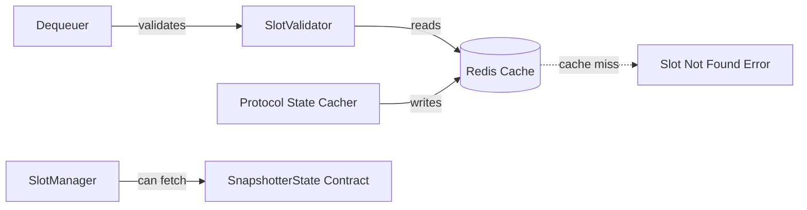
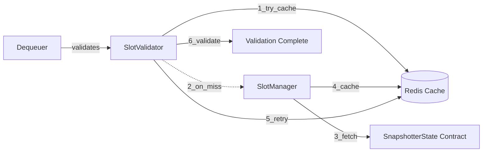
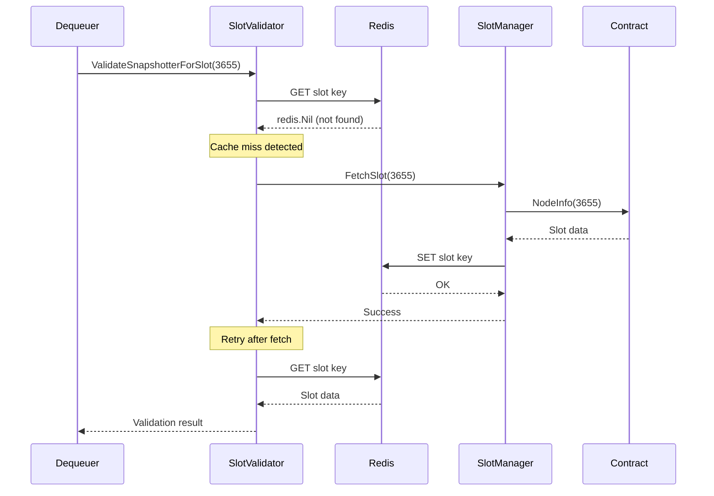

# Slot Validation Architecture

## Overview

The slot validation system verifies that snapshot submissions come from legitimate snapshotters registered in the SnapshotterState contract. To ensure resilience against cache gaps and incomplete cold syncs, the system implements **on-demand slot fetching** - automatically retrieving missing slot information from the blockchain when Redis cache misses occur.

### Key Benefits

- **Resilient to Cache Gaps**: Missing slots are automatically fetched on-demand
- **No Failed Validations**: Eliminates "slot not found" errors during submission processing
- **Backward Compatible**: Works with or without SlotManager (graceful degradation)
- **Fast Path Optimization**: Cache hits remain fast with no extra overhead
- **Minimal RPC Usage**: Only queries blockchain when cache misses occur

## Architecture

### Current Architecture (Before On-Demand Fetching)



**Problem**: SlotValidator could only read from Redis. When slot information was missing (e.g., due to incomplete cold sync), validation failed with "slot not found in protocol state cache" error.

### New Architecture (With On-Demand Fetching)



**Solution**: SlotValidator now has access to SlotManager. On cache miss, it automatically fetches the slot from the contract, caches it, and retries validation.

## Component Interactions

### SlotValidator

**Location**: `pkgs/submissions/slot_validator.go`

The SlotValidator validates snapshotter addresses against cached slot information. With on-demand fetching enabled:

1. **Cache Hit Path** (fast):
   - Reads slot info from Redis
   - Validates snapshotter address matches
   - Returns immediately

2. **Cache Miss Path** (on-demand fetch):
   - Detects Redis cache miss (`redis.Nil`)
   - Calls `SlotManager.FetchSlot()` with 30-second timeout
   - Logs on-demand fetch attempt
   - Retries cache read after successful fetch
   - Validates with freshly cached data

### SlotManager

**Location**: `pkgs/protocolstate/slot_manager.go`

The SlotManager handles batch fetching and on-demand retrieval of slot information:

- **FetchSlot()**: Fetches a single slot from SnapshotterState contract
- **FetchAllSlots()**: Batch fetches all slots during cold sync
- **Thread-safe**: Handles concurrent fetch requests safely
- **RPC Resilience**: Uses go-rpc-helper with automatic retry and failover

### Protocol State Cacher

**Location**: `pkgs/protocolstate/cacher.go`

The cacher component maintains slot information in Redis:

- **Cold Sync**: Batch fetches all slots on startup
- **Event-Driven Updates**: Watches contract events for slot changes
- **Periodic Sync**: Fallback full sync at configured intervals
- **GetSlotManager()**: Provides SlotManager access to other components

### Integration Flow



## Redis Key Patterns

Slot information is stored with namespaced keys:

```
{protocolState}:{snapshotterState}:SlotInfo.{slotID}
```

**Example**:
```
0x1234...5678:0xabcd...ef01:SlotInfo.3655
```

**Value**: JSON-encoded SlotInfo structure
```json
{
  "SnapshotterAddress": "0x...",
  "NodePrice": "1000000000000000000",
  "Active": true,
  "IsKyced": true,
  ...
}
```

**TTL**: No expiration (persists until explicitly updated)

## Performance Characteristics

### Cache Hit (Common Case)

- **Latency**: ~1ms (single Redis GET)
- **RPC Calls**: 0
- **Overhead**: None

### Cache Miss (On-Demand Fetch)

- **Latency**: ~2-5 seconds (contract call + retry)
- **RPC Calls**: 1 (with retries if needed)
- **Frequency**: Rare (only on first encounter of new slot or after cache eviction)

### Timeout Protection

- **Contract Call Timeout**: 30 seconds
- **RPC Helper Retries**: 3 attempts with exponential backoff
- **Failure Handling**: Returns clear error after timeout

## Configuration

### Required Environment Variables

When slot validation is enabled (`ENABLE_SLOT_VALIDATION=true`):

```bash
# Protocol state cacher must be enabled for on-demand fetching
ENABLE_PROTOCOL_STATE_CACHER=true

# RPC nodes for contract queries
POWERLOOM_RPC_NODES=http://node1:8545,http://node2:8545

# Slot sync configuration
SLOT_SYNC_INTERVAL=24h
SLOT_SYNC_BATCH_SIZE=20
```

### Component Dependencies

On-demand slot fetching requires:

1. **Protocol State Cacher**: Must be running to provide SlotManager
2. **Slot Validation**: Must be enabled (`ENABLE_SLOT_VALIDATION=true`)
3. **RPC Access**: Valid RPC nodes configured in `POWERLOOM_RPC_NODES`

## Operational Considerations

### Monitoring

**Success Indicators**:
```
INFO Slot 3655 not in cache - attempting on-demand fetch from contract
INFO ✅ Successfully fetched slot 3655 on-demand
```

**Failure Indicators**:
```
ERRO slot 3655 not found in cache and on-demand fetch failed: context deadline exceeded
```

### Troubleshooting

**Problem**: "slot not found in cache and on-demand fetch failed"

**Possible Causes**:
1. RPC nodes are down or slow
2. Slot doesn't exist in contract
3. Network connectivity issues

**Resolution**:
1. Check RPC node health: `curl -X POST $RPC_URL`
2. Verify slot exists on-chain
3. Check network connectivity to RPC endpoints
4. Increase timeout if RPC is consistently slow

**Problem**: High RPC usage

**Diagnosis**: Check logs for frequent on-demand fetches

**Resolution**:
1. Ensure protocol state cacher is running
2. Verify cold sync completed successfully
3. Check for Redis cache eviction (memory pressure)

### Best Practices

1. **Run Protocol State Cacher**: Always enable when using slot validation
2. **Monitor Cold Sync**: Ensure initial sync completes successfully
3. **Configure Backup RPC Nodes**: Use multiple nodes for failover
4. **Set Appropriate Sync Interval**: Balance freshness vs RPC usage (default: 24h)

## Edge Cases

### SlotManager Not Available

**Scenario**: Dequeuer runs without protocol state cacher

**Behavior**: 
- Falls back to cache-only validation
- Returns error on cache miss (existing behavior)
- No on-demand fetching

**Log**:
```
WARN Slot validation enabled but no SlotManager available - cache-only mode
```

### Contract Call Timeout

**Scenario**: RPC node slow or unresponsive

**Behavior**:
- Waits up to 30 seconds for response
- Returns clear timeout error
- Does not cache failed result

**Error**:
```
slot 3655 not found in cache and on-demand fetch failed: context deadline exceeded
```

### Invalid Slot ID

**Scenario**: Submission references non-existent slot

**Behavior**:
- Contract returns error (slot not registered)
- Error propagated to caller
- Submission rejected

**Error**:
```
slot 9999 not found in cache and on-demand fetch failed: execution reverted
```

### Concurrent Fetch Requests

**Scenario**: Multiple submissions reference same uncached slot

**Behavior**:
- Multiple goroutines call FetchSlot() concurrently
- Contract call protection via SlotManager's internal locking
- All requests complete successfully
- Only one contract call executed (others may wait or re-fetch)

## Related Documentation

- [REDIS_KEYS.md](REDIS_KEYS.md) - Redis key patterns and namespacing
- [SPAM_PROTECTION_MONITORING.md](SPAM_PROTECTION_MONITORING.md) - Submission validation flow
- [MONITORING_GUIDE.md](MONITORING_GUIDE.md) - Operational monitoring
